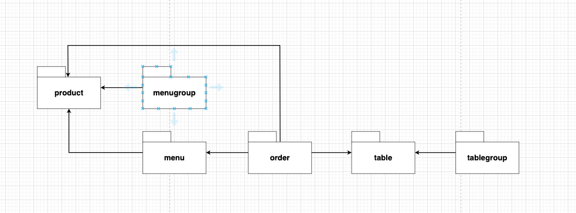

# 키친포스

## 테스트를 통한 코드 보호 TODO List
- [x] 코드 파악하여 요구사항 목록 작성
- [x] 요구사항 목록 토대로 테스트 코드 작성
    - [x] 주문 로직 테스트 코드 작성
    - [x] 주문테이블 로직 테스트 코드 작성
    - [x] 주문테이블그룹 로직 테스트 코드 작성
    - [x] 상품 로직 테스트 코드 작성
    - [x] 메뉴 로직 테스트 코드 작성
    - [x] 메뉴그룹 로직 테스트 코드 작성
  
## 서비스 리팩터링 TODO List
- [x] ui 패키지에서 domain 패키지의 직접적인 참조를 제거하기
- [x] MenuGroup, Menu, MenuProduct, Product 서비스 리팩터링
  - [x] 도메인으로 로직을 옮기면서 Service 에서 했던 테스트를 도메인 테스트로 옮기기
- [x] TableGroup, OrderTable, Orders, OrderLineItems 서비스 리팩터링
  - [x] @SpringBootTest 어노테이션을 이용해 통합테스트 경험
  - [x] 도메인으로 로직을 옮기면서 Service 에서 했던 테스트를 도메인 테스트로 옮기기
  
## 의존성 리팩터링
- [x] 이전 단계에서 받은 피드백 적용
- [x] 메뉴의 이름과 가격이 변경됐을때, 주문항목이 변경되지 않게 하기
  * 주문한 메뉴 정보를 가지는 Immutable Object 설계, 데이터 마이그레이션 경험
- [ ] 의존성 리팩터링
  - [x] 현재 시스템을 여러개의 aggregate 로 설계
  - [x] aggregate 단위로 패키지도 나눠 보기
  - [x] aggregate 끼리의 의존성을 제거하고, Id 참조 값객체로 포장하기
  - [x] 패키지간 의존성 사이클 없애기
  

  
## 요구 사항

### 주문
#### 등록
* 주문 등록시 주문 목록들이 존재해야 한다.
* 주문한 메뉴가 존재하는 메뉴여야 한다.
* 주문 등록시 주문테이블이 존재해야 하고, 비어있지 않은 테이블이어야 한다.
* 주문 등록시 `조리` 상태이다.
#### 주문 상태 변경
* 존재하는 주문만 상태이 변경 가능하다.
* 계산 완료 상태의 주문은 상태 변경이 불가하다.
#### 목록 조회
* 주문 목록을 조회할 수 있다.

### 주문테이블
#### 등록
* 주문테이블을 등록할 수 있다.
* 주문테이블을 처음 등록하면 그룹 설정은 안되어 있어야 한다.
#### 목록 조회
* 주문테이블 목록을 조회할 수 있다.
#### 주문테이블 상태 바꾸기
* 등록된 주문테이블을 주문 등록 가능상태 or 주문 등록 불가 상태로 바꿀 수 있다.
* 그룹 설정이 되어 있는 주문테이블은 상태를 바꿀 수 없다.
* 주문테이블의 주문이 조리 상태, 식사 상태이면 주문 테이블 상태를 바꿀 수 없다. 
#### 방문 손님 수 수정하기
* 방문 손님 수를 음수로 수정할 수 없다.
* 등록된 주문테이블만 방문 손님 수를 수정할 수 있다.
* 빈 테이블의 방문 손님 수는 수정할 수 없다.

### 주문테이블 그룹
#### 주문테이블 그룹화
* 2개 이상의 빈 주문 테이블을 그룹화 할 수 있다. 
* 2개 이상의 그룹 테이블을 그룹화 하면 주문 테이블을 주문 가능 상태가 된다.
#### 주문테이블 그룹 해제
* 주문 테이블 그룹을 해제할 수 있다.
* 주문 테이블 그룹의 주문 테이블이 `조리` 상태이거나, `식사` 상태이면 해제할 수 없다.

### 상품  
#### 등록
* 가격이 0원 이상인 상품을 등록할 수 있다.
#### 목록 조회
* 상품 목록을 조회할 수 있다.

### 메뉴
#### 등록
* 가격이 0 이상인 메뉴를 등록할 수 있다.
* 메뉴 그룹이 존재하는 메뉴만 등록할 수 있다.
* 상품으로 등록된 메뉴만 등록할 수 있다.
* 메뉴의 가격이 메뉴와 연결된 상품의 수량 * 가격 보다 비쌀 수 없다.
#### 목록 조회
* 메뉴 목록을 조회할 수 있다.

### 메뉴그룹
#### 메뉴그룹 등록
* 메뉴를 그룹화할 메뉴그룹을 등록할 수 있다.
#### 메뉴그룹 목록 조회
* 메뉴 그룹을 조회할 수 있다.
## 용어 사전

| 한글명 | 영문명 | 설명 |
| --- | --- | --- |
| 상품 | product | 메뉴를 관리하는 기준이 되는 데이터 |
| 메뉴 그룹 | menu group | 메뉴 묶음, 분류 |
| 메뉴 | menu | 메뉴 그룹에 속하는 실제 주문 가능 단위 |
| 메뉴 상품 | menu product | 메뉴에 속하는 수량이 있는 상품 |
| 금액 | amount | 가격 * 수량 |
| 주문 테이블 | order table | 매장에서 주문이 발생하는 영역 |
| 빈 테이블 | empty table | 주문을 등록할 수 없는 주문 테이블 |
| 주문 | order | 매장에서 발생하는 주문 |
| 주문 상태 | order status | 주문은 조리 ➜ 식사 ➜ 계산 완료 순서로 진행된다. |
| 방문한 손님 수 | number of guests | 필수 사항은 아니며 주문은 0명으로 등록할 수 있다. |
| 단체 지정 | table group | 통합 계산을 위해 개별 주문 테이블을 그룹화하는 기능 |
| 주문 항목 | order line item | 주문에 속하는 수량이 있는 메뉴 |
| 매장 식사 | eat in | 포장하지 않고 매장에서 식사하는 것 |
